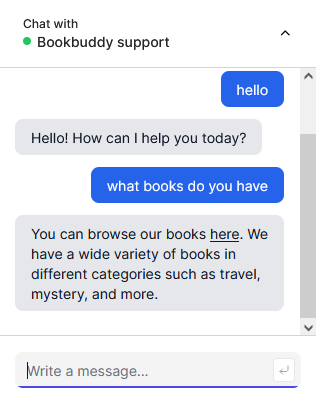

# BookBuddy - A Chatbot for Book Enthusiasts

BookBuddy is a simple chatbot designed for book enthusiasts who seek a conversational interface to discuss books and get recommendations. Built using OpenAI's powerful language models and infused with book context, BookBuddy aims to be a virtual companion for all your reading adventures.

## Features

- Interactive chatbot powered by OpenAI
- Provides book recommendations and discussions
- Simple and user-friendly interface
- Utilizes book context for personalized conversations

## Live
[Demo Version](https://openai-chatbot-nextjs-henna.vercel.app/)

## Thumbnail

